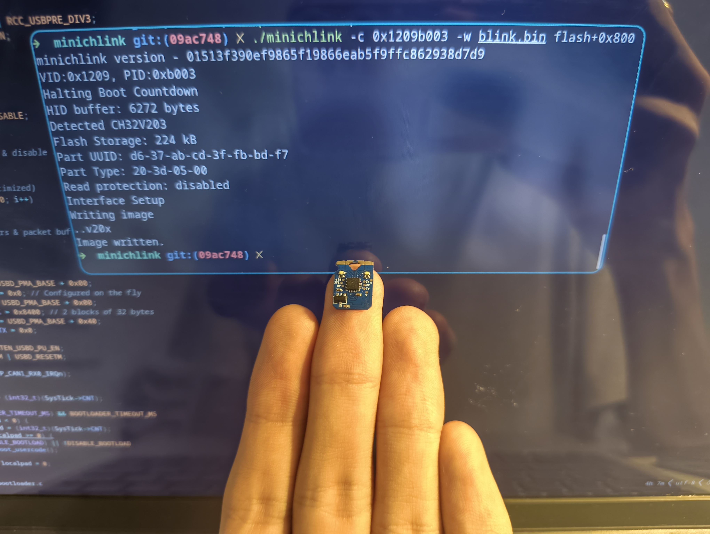
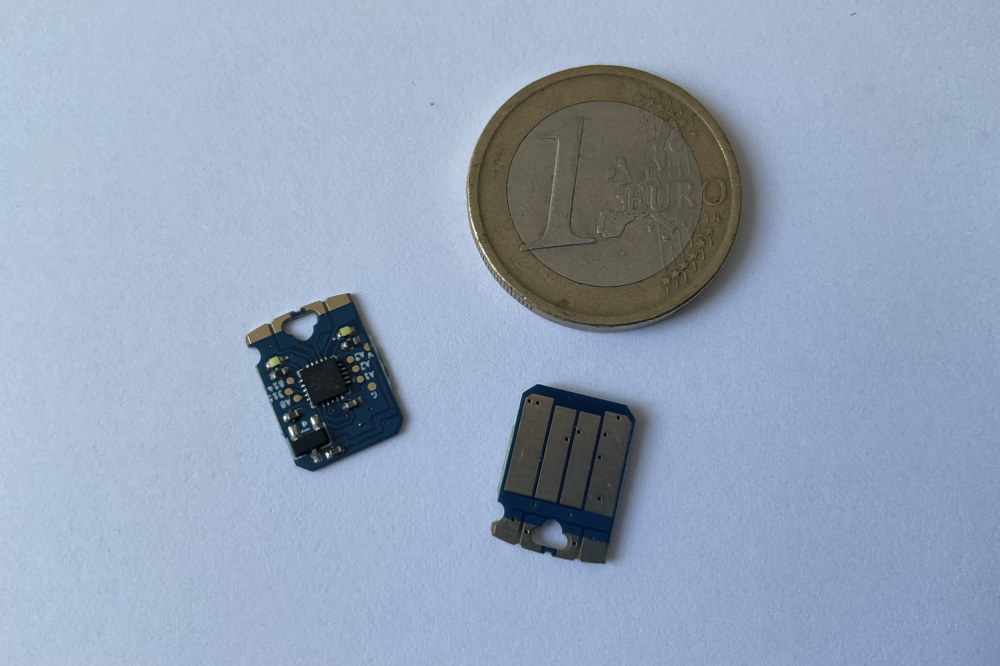
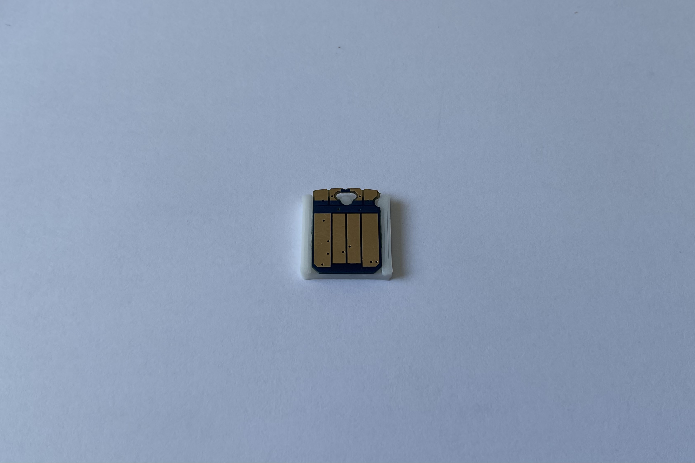
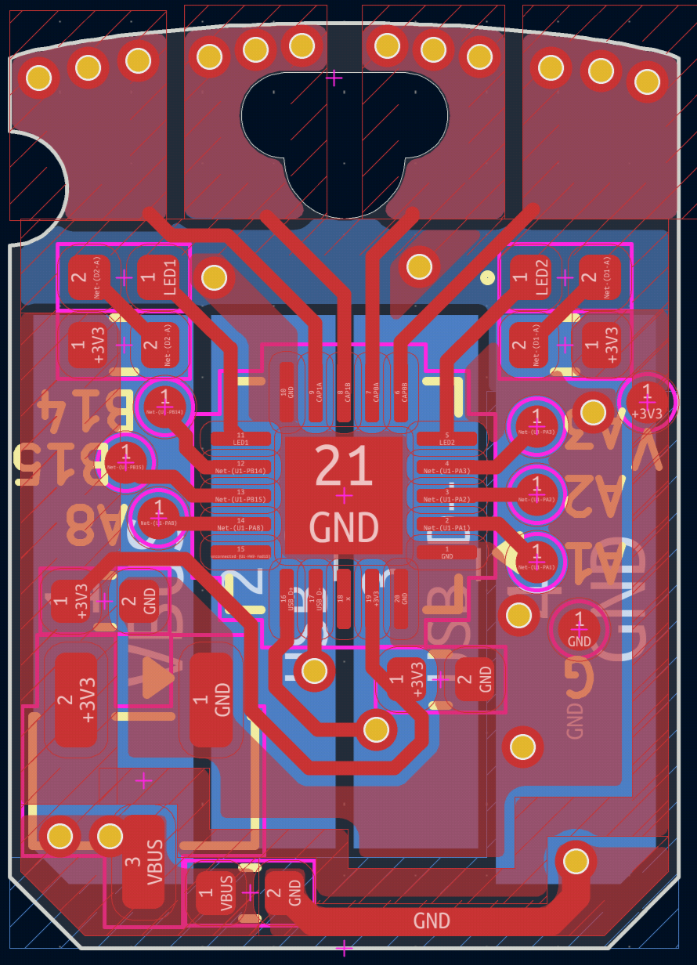

# Comu

A bite-sized CH32V203 board that fits inside your USB port.

Intrested? Sign up to the [newsletter](https://cyao.dev/subscribe.html) for info! I might do a Crowd Supply campaign if there's intrest. (No spam and very infrequent emails I promise)



Comu is a tiny CH32V203 RISC-V computer that fits inside a USB port. It is user programmable, fitted with a custom bootloader, has four captive touch buttons and two LEDs. The board is supported by [ch32fun](https://github.com/cnlohr/ch32fun), allowing easy and lightweight RISC-V bare-metal development.

The CH32V203 is equipped with 252KB of Flash and 20KB of SRAM, more than enough for most embedded applications. The chip also has a wide array of peripherals, including DMA and a 12bit ADC, allowing for a wide variety of uses. The board also exposes 6 GPIO pins via testpoints, allowing it to be embedded on custom boards for further use.

It can also easily act as a **USB HID device**, allowing portable key injections to avoid repetitive typing. With it 4 captive buttons, you can make it into a sliding volume adjuster, computer sleep trigger, screen capture device and more!



### No bloat, no weight

Using bare-metal programming in C/C++, the RISC-V program created for this chip contains 0 bloat. The minimal size of a blinky is only **40 bytes**, compared to 324KB on Arduino Pico or 12KB with Pico SDK. The [CH32V203 RM](https://www.wch-ic.com/downloads/CH32FV2x_V3xRM_PDF.html) contains all information needed to use the MCU, from register descriptions to memory layout.

The board is also very lightweight, weighing merely **0.4g** (0.2g without case). Measuring a mere 13x9.4mm, it occupies nearly no space.

Even in such constrained space, the board still boasts rich peripherals. You can directly access 2 white LEDs and 4 captive buttons. The captive buttons are double-sided edge-plated, ensuring accurate touch sensing. It is also easy to use thanks to the CH32V203's touchkey peripheral, directly handling all the troublesome parts of touch sensing. (Example in `examples/touch` folder).

### USB explorer

The CH32V203 is perfect for USB packet exploring. Its bare and well-documented USBD peripheral allows you to manipulate raw packets, while taking care of troublesome parts such as transaction handling. You can directly pair this with [usbmon](https://docs.kernel.org/usb/usbmon.html) on Wireshark to explore how USB transactions work.



### Custom bootloader

The board comes pre-programmed with a sleek custom USB bootloader to compensate for the lack of a BOOT0 button and the large size of the official bootloader. The custom bootloader is only **2KiB** in size, freeing up the 28KiB of boot flash for user use.

The bootloader is also completely open source; check out its source code in the `bootloader` folder. The only quirk is that the programs must be linked to `0x800` and flashed to 0x800, but that is taken care by the provided Makefile in the examples folder.

### Bare metal isn't your thing?

No worries! The CH32V203 is also supported by a wide array of tools: Rust via [ch32-hal](https://github.com/ch32-rs/ch32-hal), Arduino via [arduino_core_ch32](https://github.com/openwch/arduino_core_ch32), or normal WCH-HAL via [Mounriver Studio II](https://mounriver.com/download).

USB communication can be completely handled by libraries such as [tinyusb](https://docs.tinyusb.org/en/latest/index.html) or [ch32fun's usbd lib](https://github.com/cnlohr/ch32fun/blob/master/extralibs/usbd.c). All raw peripherals can also be hidden by Mounriver's HAL.

### Tons of examples

There are tons of examples in the `examples` folder on this repo, and also compatible with the examples in [ch32fun](https://github.com/cnlohr/ch32fun).



### Features

- [CH32V203](https://wch-ic.com/products/CH32V203.html) 32bit RISC-V MCU
    - 224KB Flash, 24KB Boot Flash, 20KB SRAM (64KB 0-wait Flash and 160KB Normal Flash)
    - 144MHz with internal oscillator
    - 12bit ADC
    - 49.3 μA/MHz @ run and 19.4 μA/MHz @ sleep
    - USB full speed peripheral
- 4x Captive touch buttons w/ castellated edges
- 2x LEDs
- 6x GPIOs broken out via testpads
- Fits in a USB-A connector

### Pins

- LED1: PB11
- LED2: PA4
- Captive touch:
    - A5 (PA5)
    - A7 (PA7)
    - A8 (PB0)
    - A9 (PB1)
- GPIOs: PB14, PB15, PA1, PA2, PA3, PA8

### Usage

Dependencies: Make, riscv64-gcc, libusb (Checkout dependency list [here](https://github.com/cnlohr/ch32fun/wiki/Installation))

Clone this respository and pull the submodules:

```
$ git clone https://github.com/cheyao/comu
$ cd comu
$ git submodule update --init --recursive
```

Go into the examples folder and build an example:

```
$ cd examples/blink
$ make
```

Now, the example should be built. When you insert your Comu into your USB port, it should stay in the bootloader for the first 5 seconds. You can then re-run `make flash` to flash the binary onto the chip!

Now you can make your applications! I recommend starting off by copying an example, as you need to flash to address `flash+0x800` to avoid overwriting the custom bootloader.

If the flashing isn't working, please read through this [wiki](https://github.com/cnlohr/ch32fun/wiki/Installation) for operating system setup, and try re-building minichnlink. (I've submitted a few new patches for the ch32v203 flashing a week ago)

### Can I get one?

I've put it up on the following sites:

<a href="https://lectronz.com/products/comu" alt="Buy it on Lectronz"></a>

Mostly just labor fees :)

### Attributions

Form factor credit goes to tomu.

