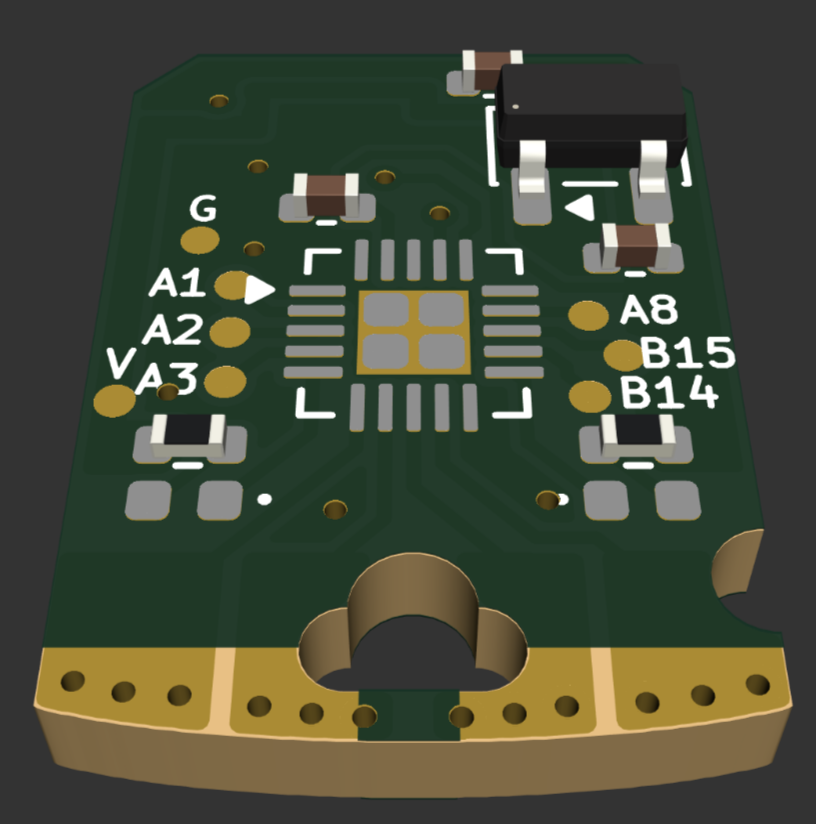

# Comu

A bite-sized CH32 board that fits inside your USB port.

Comu is a tiny CH32V203 RISC-V computer that fits inside a USB port. It is user programmable, fitted with a custom bootloader, has four captive touch buttons and two leds. The board is supported by [ch32fun](https://github.com/cnlohr/ch32fun), allowing easy RISC-V bare metal development.

The CH32V203 is equipped with 224KB of Flash and 20KB of SRAM, more than enough for most embedded applications. The chip also has a wide-array of peripherals, including DMA and a 12bit ADC, allowing for a wide variety of uses.

### No bloat, no weight

Via bare-metal programming in C/C++, the RISC-V programs contains 0 bloat. The size of a blinky is only 40 bytes, compared to 324KB on Arduino Pico or 12KB with Pico SDK. The [CH32V203 RM](https://www.wch-ic.com/downloads/CH32FV2x_V3xRM_PDF.html) contains all information needed to use the MCU, from register descriptions to memory layout.

TODO:

Rust is also supported via [ch32-hal](https://github.com/ch32-rs/ch32-hal) too!

Features:
- 1x [CH32V203](https://wch-ic.com/products/CH32V203.html) 32bit RISC-V MCU
    - 224KB Flash, 20KB SRAM (64KB 0-wait Flash and 160KB Normal Flash)
    - 144MHz with internal oscillator
    - 12bit ADC
    - USB full speed peripheral
- 4x Captive touch buttons
- 2x LEDs
- 6x GPIOs broken out via testpads
- Fits in a USB-A connector

Form factor credit goes to tomu.

| Item  | Cost |
| ----- | ---- |
| PCB   | 130$ |
| Parts | 70$  |

